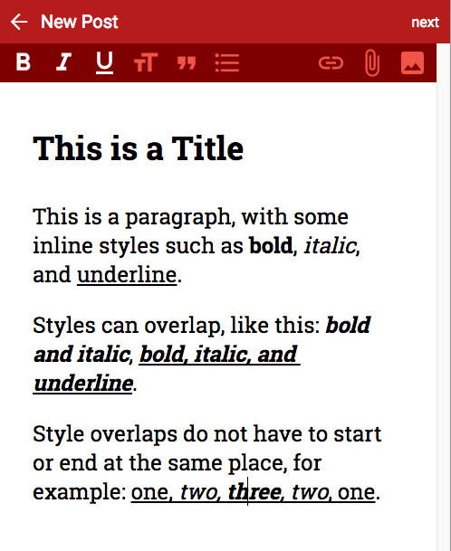
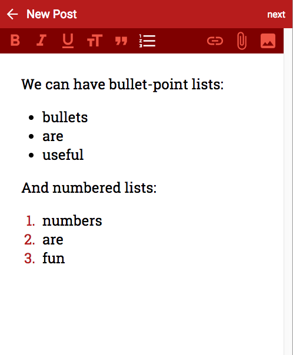
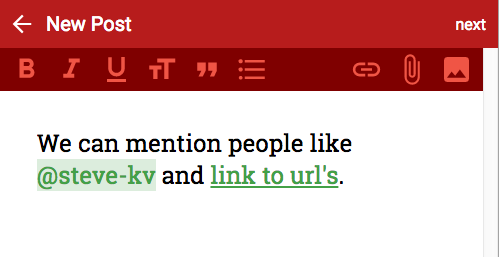

# Full-Stack ES201x Developer Test

This test is derived from a real task we faced in our current project.

We don't necessarily expect a full working solution, or that you attempt all of the tasks, but if you can show a professional engineering approach, nice code, and reasonable progress towards a solution, you may be the developer we are looking for.

You should try to approach the test just as you would approach any task assigned to you in a normal working day.

## Submission

* Create a public github repo
* Push your code to it
* Document the version of node you've used, and any information that may help us to best appreciate your submission.

Oh, and have fun ...

## Background

Draft.js is a framework for building rich text editors in React. Draft.js makes it possible to build any type of rich text input, whether you're just looking to support a few inline text styles or building a complex text editor for composing long-form articles.

We're using Draft.js in our system to allow users to compose articles that have titles and styling (bold, italic, underline). Here's what our editor currently looks like:



## Task 1

Because a text editor doesn't exist in a vacuum and it is important to save contents for storage or transmission, Draft.js exports to a JSON format. Exporting the content from the screenshot above produces JSON that looks like this:

```
{
    "blocks" : [
      {
        "entityRanges" : [ ],
        "inlineStyleRanges" : [ ],
        "depth" : 0,
        "type" : "header-two",
        "text" : "This is a Title",
        "key" : "e3fag"
      },
      {
        "entityRanges" : [ ],
        "inlineStyleRanges" : [
          {
            "style" : "BOLD",
            "length" : 4,
            "offset" : 53
          },
          {
            "style" : "ITALIC",
            "length" : 6,
            "offset" : 59
          },
          {
            "style" : "UNDERLINE",
            "length" : 9,
            "offset" : 71
          }
        ],
        "depth" : 0,
        "type" : "unstyled",
        "text" : "This is a paragraph, with some inline styles such as bold, italic, and underline.",
        "key" : "etd8o"
      },
      {
        "entityRanges" : [ ],
        "inlineStyleRanges" : [
          {
            "style" : "BOLD",
            "length" : 15,
            "offset" : 31
          },
          {
            "style" : "BOLD",
            "length" : 27,
            "offset" : 48
          },
          {
            "style" : "ITALIC",
            "length" : 15,
            "offset" : 31
          },
          {
            "style" : "ITALIC",
            "length" : 27,
            "offset" : 48
          },
          {
            "style" : "UNDERLINE",
            "length" : 27,
            "offset" : 48
          }
        ],
        "depth" : 0,
        "type" : "unstyled",
        "text" : "Styles can overlap, like this: bold and italic, bold, italic, and underline.",
        "key" : "750vk"
      },
      {
        "entityRanges" : [ ],
        "inlineStyleRanges" : [
          {
            "style" : "UNDERLINE",
            "length" : 25,
            "offset" : 75
          },
          {
            "style" : "ITALIC",
            "length" : 15,
            "offset" : 80
          },
          {
            "style" : "BOLD",
            "length" : 5,
            "offset" : 85
          }
        ],
        "depth" : 0,
        "type" : "unstyled",
        "text" : "Style overlaps do not have to start or end at the same place, for example: one, two, three, two, one.",
        "key" : "abe9l"
      }
    ]
  },
  "
```

When presenting this content for users to read, we need to render it as HTML. One way to do that would be to reload it into a draft.js editable field, however draft.js is a large library and entails a significant download and startup-time overhead.

Instead, we want to convert the JSON directly to HTML ahead of time, so that we can send the pre-rendered HTML directly to the user's browser.

Task 1 is to write a converter which can convert the above JSON to renderable HTML that matches the presentation in the screenshot above.

Your rendered HTML should look something like this:

```
<article>
  <h2>This is a Title</h2>
  <span>This is a paragraph, with some inline styles such as <span class="bold">bold</span>, <span class="italic">italic</span>, and <span class="underline">underline</span>.</span>
  <span>Styles can overlap, like this: <span class="bold"><span class="italic">bold and italic</span></span>, <span class="bold"><span class="italic"><span class="underline">bold, italic, and underline</span></span></span>.</span>
  <span>Style overlaps do not have to start or end at the same place, for example: <span class="underline">one, <span class="italic">two, <span class="bold">three</span>, two</span>, one</span>.</span>
</article>
```

## Task 2

In addition to the inline styling in task 1, our editor supports bullets and numbered-lists.



The JSON for an article with bullets and numbered-lists looks like this:

```
  {
    "blocks" : [
      {
        "entityRanges" : [ ],
        "inlineStyleRanges" : [ ],
        "depth" : 0,
        "type" : "unstyled",
        "text" : "We can have bullet-point lists:",
        "key" : "gsfa"
      },
      {
        "entityRanges" : [ ],
        "inlineStyleRanges" : [ ],
        "depth" : 0,
        "type" : "unordered-list-item",
        "text" : "bullets",
        "key" : "4ekf9"
      },
      {
        "entityRanges" : [ ],
        "inlineStyleRanges" : [ ],
        "depth" : 0,
        "type" : "unordered-list-item",
        "text" : "are",
        "key" : "fksk7"
      },
      {
        "entityRanges" : [ ],
        "inlineStyleRanges" : [ ],
        "depth" : 0,
        "type" : "unordered-list-item",
        "text" : "useful",
        "key" : "doaj3"
      },
      {
        "entityRanges" : [ ],
        "inlineStyleRanges" : [ ],
        "depth" : 0,
        "type" : "unstyled",
        "text" : "And numbered lists:",
        "key" : "a6m07"
      },
      {
        "entityRanges" : [ ],
        "inlineStyleRanges" : [ ],
        "depth" : 0,
        "type" : "ordered-list-item",
        "text" : "numbers",
        "key" : "fg1a3"
      },
      {
        "entityRanges" : [ ],
        "inlineStyleRanges" : [ ],
        "depth" : 0,
        "type" : "ordered-list-item",
        "text" : "are",
        "key" : "8dt2t"
      },
      {
        "entityRanges" : [ ],
        "inlineStyleRanges" : [ ],
        "depth" : 0,
        "type" : "ordered-list-item",
        "text" : "fun",
        "key" : "4a6lo"
      }
    ]
  }
```

Task 2 is to update your converter to handle bulleted and numbered-lists.

Your rendered HTML should look something like this:

```
<article>
  <span>We can have bullet-point lists:</span>
  <ul>
    <li>bullets</li>
    <li>are</li>
    <li>useful</li>
  </ul>
  <span>And numbered lists:</span>
  <ol>
    <li>numbers</li>
    <li>are</li>
    <li>fun</li>
  </ol>
</article>
```

### Task 3

In addition to the inline styling and lists in tasks 1 and 2, our editor supports "entities", which include additional data that is not visible in the text. Some examples of entities include @mentions, links, and images.



The JSON for an article with mentions and links looks like this:

```
  {
    "blocks" : [
      {
        "entityRanges" : [
          {
            "key" : 0,
            "length" : 9,
            "offset" : 27
          },
          {
            "key" : 1,
            "length" : 13,
            "offset" : 41
          }
        ],
        "inlineStyleRanges" : [ ],
        "depth" : 0,
        "type" : "unstyled",
        "text" : "We can mention people like @steve-kv and link to url's.",
        "key" : "2emh7"
      }
    ],
    "entityMap" : {
      "0" : {
        "data" : {
          "img" : {
            "_id" : "59d785576a02553c4109c8ce",
            "contentType" : "image/png",
            "originalFileSize" : 2271,
            "originalFileName" : "avatar.png",
            "uuid" : "734114e0-aa9a-11e7-8f69-831ae15637d2"
          },
          "text" : "steve-kv",
          "id" : "59d785576a02553c4109c8cd"
        },
        "mutability" : "IMMUTABLE",
        "type" : "MENTION"
      },
      "1" : {
        "data" : {
          "description" : "This is a link to Google",
          "url" : "http://www.google.com"
        },
        "mutability" : "MUTABLE",
        "type" : "LINK"
      }
    }
  }
```

Task 3 is to update your converter to handle mentions and links.

Here you can assume that you are converting to React JSX rather than HTML, and output JSX markup like `<Mention data={ ... }>@steve-kv</Mention>` and `<Link data={ ... }>link to url's</Link>` to represent entities.

Your rendered HTML/JSX should look something like this:

```
<article>
  <span>We can mention people like <Mention data={{"img" : {
    "_id" : "59d785576a02553c4109c8ce",
    "contentType" : "image/png",
    "originalFileSize" : 2271,
    "originalFileName" : "avatar.png",
    "uuid" : "734114e0-aa9a-11e7-8f69-831ae15637d2"
  },
  "text" : "steve-kv",
  "id" : "59d785576a02553c4109c8cd"}}>@steve-kv</Mention> and <Link data={{"description" : "This is a link to Google", "url" : "http://www.google.com"}}>link to url's</Link>.</span>
</article>
```

## Task 4

Relax, we're kidding. Thanks for taking the test, we hope it was kinda fun. Enjoy the rest of your day!
